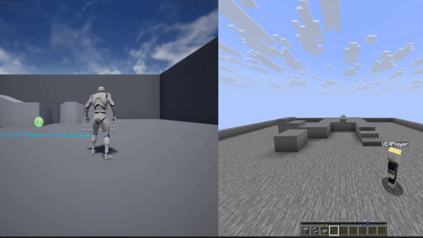

# Minecraft and Unreal Engine 4 crossplay prototype

-----------------



-----------------

## Tested on
Unreal Engine 4.26.2

Minecraft Java 26.2 

### May work on more versions of Minecraft and Unreal Engine

-----------------

#### Required 

- **[VaRest (Plugin for Unreal Engine)](https://github.com/ufna/VaRest)**
- **[Python 3.12](https://www.python.org/downloads/release/python-31210/)**
- **[BotMine (Library for Python)](https://pypi.org/project/botmine/)**
- **[Java](https://www.oracle.com/java/technologies/downloads/#jdk26-windows)**
- **[Minecraft Java Edition](https://www.minecraft.net/en-us)**
- **[Unreal Engine](https://www.unrealengine.com/)**
- **[Minecraft Java Edition Server](https://www.minecraft.net/en-us/download/server)**

-----------------

1. **Setting up directories**
- Create a folder with any name you want
- Inside that folder put the 2 python files **(server.py and bot.py)**
- In the folder create a folder and call it **server**
- Inside the server folder place your Minecraft Java server and name it **server.jar**

2. **Setting up the Minecraft Server**
- Open Command Prompt inside the directory you have **server.py** inside
- Type ```python server.py```
- Agree to the eula to set up the server
- Inside the server folder you will see **server.properties** open it
- Set ```allow-flight``` to true
- Set ```online-mode``` to false
- Inside the **server.py** you will see ```JAVA_MEMORY``` this is the memory the server will use the default is 1 gigabyte but you can change it

3. **Inside Unreal Engine**
- Add the **BP_Crossplay** actor into your content folder
- Drag **BP_Crossplay** actor to the viewport

4. **How to use**
- Run the server.py in Command Prompt with ```python server.py```
- When Command Prompt window says **MINECRAFT IS READY** run ```python bot.py``` in a new window
- On Minecraft press add server then put the server address to ```127.0.0.1:25565``` and join it
- On Unreal Engine press the play button at the top of the screen

-----------------

## FAQ
* Does this use c++?
  * No it uses Python and VaRest Plugin which doesnt use c++

* Why doesnt my skin work
  * When Minecraft doesn't use online mode skins don't work so it uses the default ones
 
* The player is stuck
  * This is something that happens with some environment if you go back to where your stuck in Unreal Engine it should fix
 
-----------------

# Credits

* [ufna](https://github.com/ufna) - Made VaRest

  

